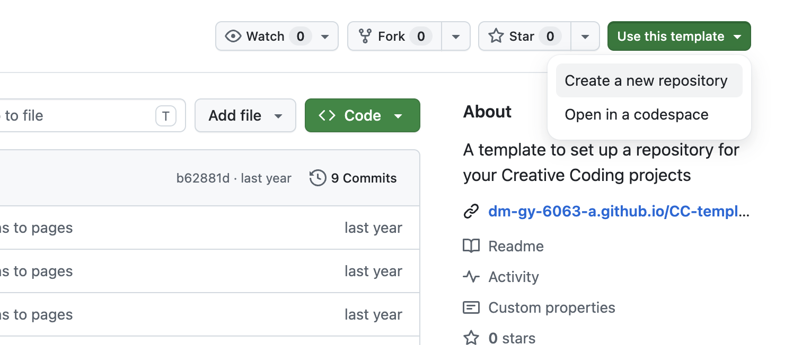
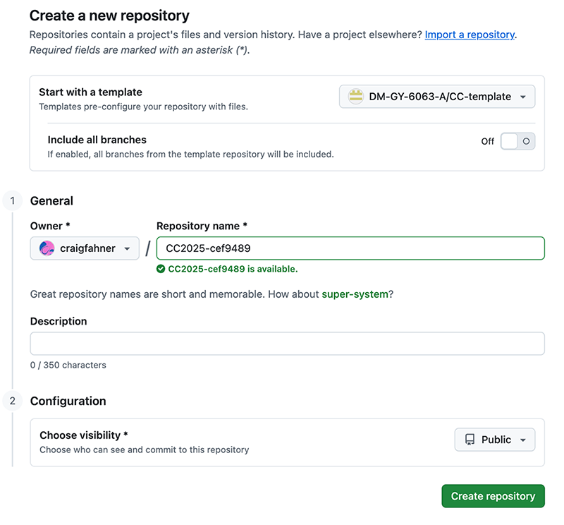
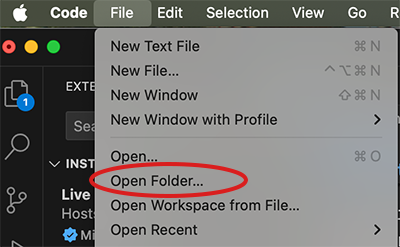

## Getting set up with VSCode, GitHub and GitHub Pages

### Github
GitHub provides the infrastructure for this course. It is how I will share assignments and examples with you, and it is how you will submit your own notes and assignments. It also allows you to publish your content to the web easily through something called GitHub Pages.

- Sign up for a [new GitHub account](https://github.com/). If you already have one, you can either use your existing account or sign up for a new, course-specific account. ([video](https://www.youtube.com/watch?v=ZVRuPO8nCLA)).
- Download and install [GitHub Desktop](https://desktop.github.com/). ([video](https://www.youtube.com/watch?v=dN5A0kDdCwk)).
- Log into your new GitHub account from GitHub desktop.

### VSCode
VSCode is the code editor we will be using in this class. It is essentially a fancy text editor that is streamlined for editing code. While you can technically edit code in any basic text editor, VSCode is nice because it can auto-format your code, it color-codes different elements of your code, and you can preview what you're working on in the editor.

- [Download VSCode](https://code.visualstudio.com/)
- Install VSCode
- Open VSCode and install the [p5v2.0 project generator](https://marketplace.visualstudio.com/items?itemName=Irti.p5js-project-generator) which will also include the LiveServer extension and [Prettier](https://marketplace.visualstudio.com/items?itemName=esbenp.prettier-vscode)

The easiest way to install extensions is to click on the extension icon in the code editor, and to search for the extensions by name, after which you can click the "install" button. ([video](https://www.youtube.com/watch?v=epQgFt4NTPI))

### Creating a course repo
Everything you do in this course will be contained in one folder. A GitHub Repository or "repo" is a folder that you can synchronize to a server. This serves as a version control mechanism, a storage/backup solution, and a method to share and publish your work. I've shared a template repository that has everything you need in it to get started writing code in p5.js. You can create a new repository from the template using the following steps:

- Go to this link: https://github.com/DM-GY-6063-A/CC-template/
- Click the "Use this template" button and select "create a new repository":

- Give your repository a name like this: "CC-[your NetID]". Make sure the repository is set to Public, as this will allow you to publish a website.

- After clicking on "Create Repository", you will arrive at the page for your new repo. Click on settings at the top, and enable GitHub pages. In the "about" settings on the code page, select the "Use your GitHub Pages website" option.
- After a few minutes, your GitHub pages site will be up (and will display the template content, for now) – you can click on the URL in the About section of your code page to check. This will be the URL for your course portfolio.

### Cloning your repo to your computer
- Once you've logged into your GitHub account on GitHub desktop, "clone" your new repository onto your computer by clicking on the Repository tab in the top left corner, and selecting "Clone Repository" from the "Add" dropdown menu. (video)
- You will be prompted to select a location on your computer to store the repository. This is where the repo will live on your computer. Once you set this location, don't move the folder manually, as it will sever GitHub Desktop's ability to track changes and synchronize. Select a location that you know will remain persistent on your computer.
- When you click "Clone", a folder will be created on your computer with all the files in the repository. Click "Show in Finder" to navigate to the files themselves.

### Opening your folder in VSCode
- In VSCode, select "Open Folder" from the File menu:

- All the files in your folder can now be accessed in the "explorer" panel at the left.
- Navigate to the "week1" folder and right click on the "index.html" file, selecting "Show Preview". This will open a panel on the right side of the editor that previews the code you are working on.
- Any changes you make in the VSCode editor must be saved before they can be synchronized with your GitHub repo. Make a small change to the README.md file in the root folder, changing the header from "p5.js multi sketch template" to "[your name]'s Creative Coding Repo"

### Committing and pushing in GitHub Desktop 
- Once you've made a change to the README.md file, open GitHub desktop. The changes you've made will be shown on the left panel of the interface.
- To commit, make a note in the "Summary" field below the listed changes. This typically is a short description of what you've changed in your repo.
- Committing saves the "version" you have just created; after committing, you still need to "push" the new version to the server. You do this with the "Push Origin" button in the top right corner. Once you've done that, your changes will be synchronized with the GitHub remote server, and after a few minutes you can preview them on your GitHub Pages site.

### Testing the setup
Submit a link to your edited readme file to demonstrate that you've successfully pushed your changes to Github.