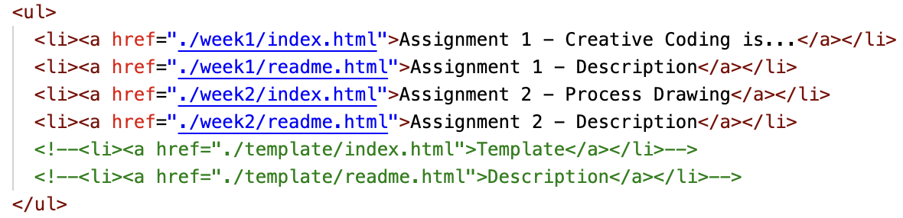

## Process Drawing
- On paper, create a simple drawing inside of a square frame using three of the following simple shapes: Circle, Square, Triangle, Line.
- Come up with a set of rules about how those individual shapes could be modified within that frame – for instance, the triangle could be scaled to be either half or two times its original size, or the circle could be moved (or translated) up or down by half of its diameter. On paper, experiment with some of these transformations, drawing at least five variations.
- Take a clear photograph or scan of your illustrations.
- [Download this template.](https://drive.google.com/file/d/152JGWcpWAdpNRd2X15wsJcodLT6ig37j/view?usp=drive_link) Add it to your cloned repository in a folder titled 'week2.' 
- Edit your sketch using VSCode. Use the LiveServer to preview your work as you go.
- Translate your drawing into code, using translation functions for each of the shapes. Apply a new color palette and transformations each time the user clicks on the canvas. 
- If you’re struggling with the logic of your plan and rending through your different iterations, try using the random() function to generate different versions of your sketch.
- Add the reference image(s) to your repo in your media folder ('week2/media'). 
- Use the readme.html file to describe what you intended to do with each iteration. How did these differ from what you would up with? 
- Bonus Goals: Edit the CSS/style within your main index.html page and/or your description ('/week2/readme.html'). 
- Update your course website, uploading your work to the web.

### Updating Your Course Website
- Go to the folder containing the clone of your repository for this course.
- How to update your list of sketches and description within the main index.html file:
    - In your main index.html, replace the code for with your list (```<ul></ul>```) with the following:
    
        - See [this page](https://github.com/melodyloveless/creativeCodingFall2026_template/blob/main/index.html) for more info.
- How to update your description for this week's coding assignment:
    - Go to the folder 'week2'. Edit 'readme.html'.
    - Add your description within the paragraph tags (```<p></p>```. For example: ```<p>Your description here</p>```).
    - For your references: you'll be working with different areas of the link tag (```<a></a>```). Add the url to your source within the href attribute (```href="http://example.com"```). Add the description of your reference in between the opening and closing tags (```<a>Name of reference here</a>```). Add another item in your list using ```<li></li>```(For example: ```<li>item in your list.</li>```)
    - Update the `````` tag. Replace the src(source) with your media. (For example: ```<img src="media/yourImage.png"...```)
    - Review the template for more instructions/hints on how to edit your template.
- How to publish updates online:
    - Open GitHub Desktop. Press 'commit' and 'push origin'.

Review notes from this week and last for more information.
