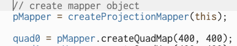
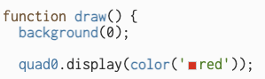
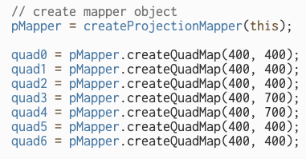
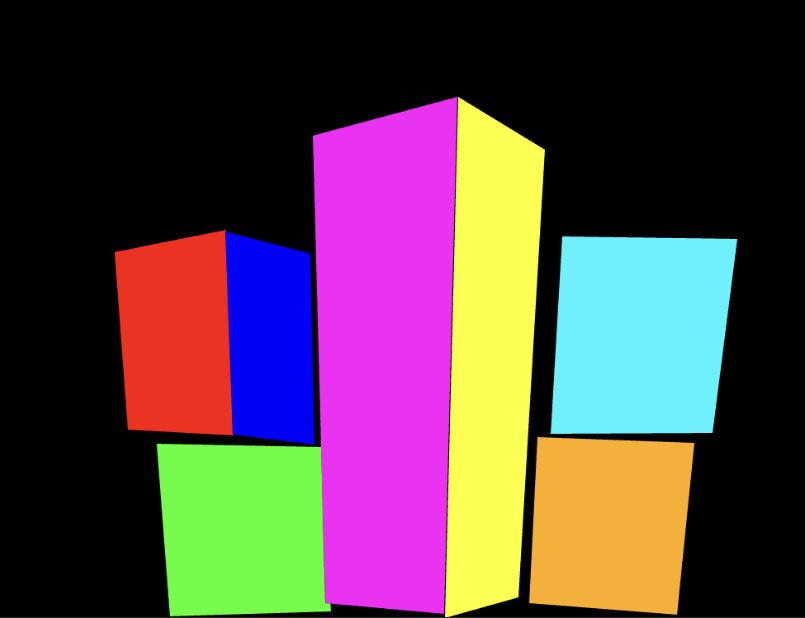
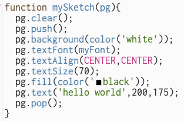

## Projection Mapping

[Click here to download the p5.mapper template folder](https://download-directory.github.io/?url=https%3A%2F%2Fgithub.com%2Fcraigfahner%2FCC2025-cef9489%2Ftree%2Fmain%2Fp5-mapper-template) (save it into your course repo)

### Set up your scene
- Turn on your projector and examine the throw range / projectable area
- Set up your scene within this projectable area
- Try to be conscious of the coverage of all the surfaces on which you intend to project
  - Make sure, for instance, that the tops of any pedestals are being hit by the projector, if you want to project onto them
- Be mindful of shadows cast by the projector onto objects in your scene. Arrange your objects so that they aren’t casting visible shadows on one another
- Label your surfaces with a post-it note (0, 1, 2, 3, 4 etc) – we will create functions in p5.js that correspond with each surface

### Experiment with mapping a single surface
- Once you’ve added the template folder to your repo, rename it to “p5-mapper-workshop”
- Create a single “quad” projection surface in p5.mapper:
  - In setup:
    
  - In draw, assign a color to this surface
    
- Run your p5 code. Press ‘f’ to go full screen
- Press ‘c’ to enter calibration mode. You will notice control points show up on each of the corners of your projected surface.
- Click and drag the control points so that they align with the corners of your object
- Press ‘c’ again to exit calibration mode

### Map all of your surfaces
- Now that we know how to map one surface, we can create p5.mapper objects for every surface in our installation. Use a naming convention that aligns with the labels you assigned to each of your projection surfaces. Set up dimensions that are roughly proportionate to your actual surfaces:

 - Using the same approach as above, assign a unique color to each surface. Make note of which color aligns with each specific surface (easiest to make note of this on paper, as you can’t look at your code and map at the same time)
- Run your code, enter full screen, and map every p5 color to its corresponding surface in your installation

- **SAVE YOUR MAPPINGS!** Press “s” to save. A json file will download to your computer. Save this into your project, and your sketch will recall it next time you open it!

### Running p5 sketches on your surfaces
- P5.mapper lets you assign a p5 sketch to one or more surfaces.
- You do this using the displaySketch method on your p5.mapper object:
  - <pre>quad3.displaySketch(mySketch);</pre>
- In the above line, quad3 is being assigned a sketch called “mySketch”. mySketch is a function that appears elsewhere in your code. It acts as an instance of a p5.js canvas. As such, you need to refer to the specific instance when writing your code:

- Notice that every p5-related function has “pg.” in front of it. “pg” is being passed through the mySketch function as a specific “instance” of p5.js. To ensure we are only addressing our mini-sketch and not the bigger sketch within which it is contained, use the “pg.” reference when you are writing your individual sketches within p5.mapper functions.
- Be conscious of the dimensions you initially assigned when setting up your surfaces, as you’ll refer to this size when positioning things in your mini-sketches.